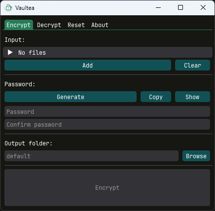

<h2 align="center">Vaultea :tea:</h2>

  

_Vaultea_ is simple and easy to use file encryption app. It supports batch file processing and folder encryption while ensuring data authenticity and plausible deniability.

## *Disclaimer*
*This software is a hobby project and has not been audited by any third party in any way. Even though it seems to work fine, if your life or safety depends on it, don't use this.*

## Features
* Batch file processing
* Folder encryption (automatic zipping before encryption)
* Data authencity
* Plausible deniability
* [Passphrase generation](https://github.com/70sh1/Vaultea#generating-a-passphrase)

## Installation

### Windows
Download the latest release from the [releases](https://github.com/70sh1/Vaultea/releases) page. Both portable and installer versions are available.

### Linux
*The required glibc version is 2.31 or above. Use `ldd --version` to check.*

#### Ubuntu / Debian
1. Download the latest `.deb` from the releases page.

2. Run `sudo apt install ./release-name.deb`

#### Fedora / RedHat
1. Download the latest `.rpm` from the releases page.

2. Run `sudo dnf install release-name.rpm`

#### Arch
1. Download the latest `.pkg.tar.zst` from the releases page.

2. Run `sudo pacman -U release-name.pkg.tar.zst`

### MacOS*
Vaultea has not been tested on macOS by any means, therefore prebuilt binaries are not provided. In theory, it *should* work when [run from source](#running-from-source). Feedback about the macOS experience is welcome on *issues* or *discussions*.

### Running from source
*The required python version is 3.10 or above.*
1. Clone/download the repo
2. cd into project root directory
3. Run `poetry install` *OR* `pip install -r requirements.txt`
4. Run `python main.py`

## Generating a passphrase
Passphrases are awesome. Vaultea provides the ability to generate one with a single click. It consists of six randomly selected words from EFF's long wordlist. You can read more about passphrases [here](https://www.eff.org/deeplinks/2016/07/new-wordlists-random-passphrases).

*TL;DR they are considered stronger and much easier to remember than regular passwords.*

## Tips
* It is safe to rename any files that are encrypted with Vaultea.
* To enhance security, a new key is derived for each file using the password, and the key derivation process is intentionally slow (to counter brute force attacks). Due to this, encrypting numerous individual files, regardless of their size, can be time-consuming. Putting these files into a folder and then encrypting the folder is recommended.

## Current limitations
* The maximum file or folder size is **256 GiB** *per item*. Vaultea **does not** implement any mechanism to work around this limitation, such as generating and writing a new nonce every 256 GiB. It will not let you add such a large file or folder.
* Vaultea does not implement any mechanisms to add data corruption resistance (such as error correction codes) to the files it processes. Therefore, **it is strongly recommended to perform regular backups of important files**.

* Vaultea doesn't preserve original metadata.

## Under the hood
Vaultea uses `ChaCha20-Poly1305` with nonce (IV) length of 12 bytes for encryption and data authentication, paired with `scrypt` key derivation function with the following parameters: `key_len=32, N=2**20, r=8, p=1` and salt length of 16 bytes.

### How does it work?
For each file:

If a folder is selected, it gets zipped first, without compression, then:
1. A new 256-bit random key is generated (data key).
2. The contents of the file are encrypted using ChaCha20 with this data key.
3. Another key is generated using the password entered by the user, the scrypt key derivation function, and a random salt.
4. The key from step 1 is encrypted with the key from step 3.
5. The encrypted key, salt, MAC tags (Poly1305) of the key and data, and the encrypted data itself are written to the output file.

## Acknowledgements
[DearPyGui](https://github.com/hoffstadt/DearPyGui) - GUI

[DearPyGui_Extend](https://github.com/fabriciochamon/DearPyGui_Extend) - Custom dpg file browser.

[pycryptodome](https://github.com/Legrandin/pycryptodome) - Encryption and decryption, key deriving.
